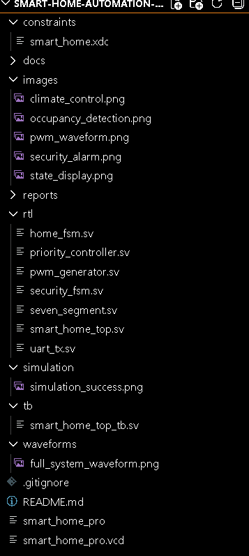
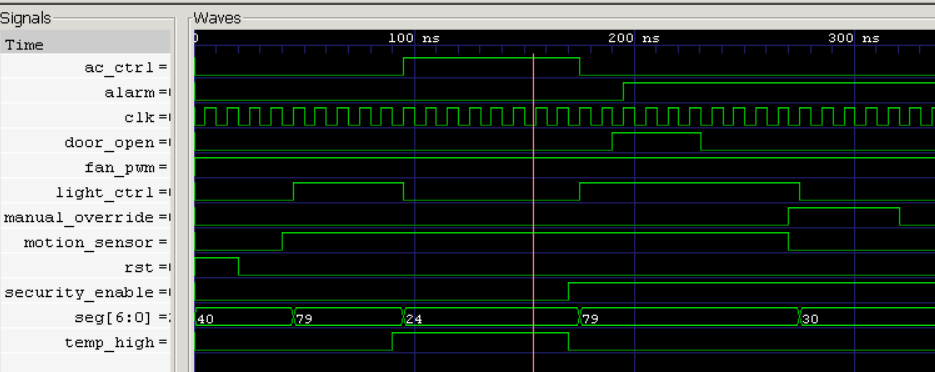
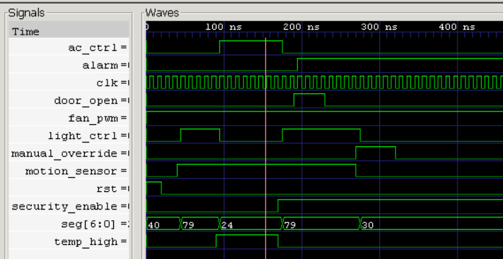
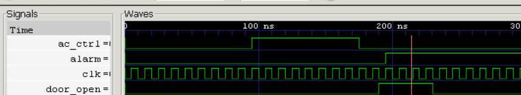
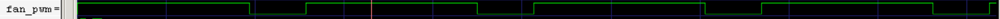
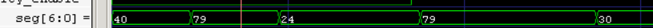
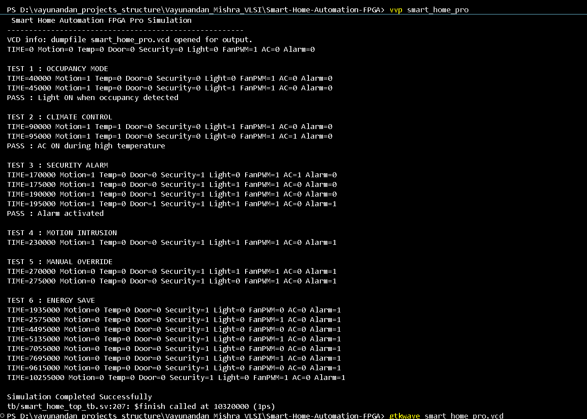
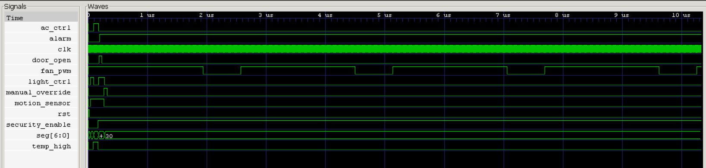

# 🏠 Smart Home Automation FPGA Pro

## 📌 Overview

Smart Home Automation FPGA Pro is an industry-oriented FPGA and SystemVerilog project that demonstrates intelligent home automation using Finite State Machines (FSMs), security monitoring, PWM-based fan control, seven-segment display interfacing, UART communication, and real-time appliance control logic.

The system processes sensor inputs such as motion detection, temperature status, and door monitoring to automatically control home appliances while ensuring security and energy efficiency.

This project was developed as a VLSI/FPGA portfolio project to demonstrate RTL design, digital design concepts, verification, and FPGA implementation methodologies.

---

## 🎯 Project Objectives

* Design an FPGA-based smart home automation controller.
* Implement automation logic using FSMs.
* Control appliances based on sensor inputs.
* Implement security monitoring and intrusion detection.
* Demonstrate PWM fan speed control.
* Display system states on a seven-segment display.
* Verify functionality using simulation and waveform analysis.
* Create an FPGA-ready RTL architecture suitable for future IoT integration.

---

## 🚀 Key Features

### Home Automation FSM

* Occupancy detection
* Automatic light control
* Climate control mode
* Energy-saving mode

### Security FSM

* Armed mode
* Intrusion detection
* Alarm activation
* Security monitoring

### PWM Fan Controller

* Hardware-based PWM generation
* Variable duty cycle support
* FPGA-friendly implementation

### Priority Controller

* Security events have highest priority
* Manual override support
* Automation logic prioritization

### Seven Segment Display

* Displays current FSM state
* Real-time status indication

### UART Communication

* Framework for future PC/dashboard monitoring
* Expandable for IoT integration

### Verification

* SystemVerilog testbench
* GTKWave waveform verification
* Simulation-based validation

---

# 🏗️ System Architecture

```text
                 +------------------+
                 | Motion Sensor    |
                 +------------------+
                           |
                 +------------------+
                 | Temperature      |
                 | Sensor           |
                 +------------------+
                           |
                 +------------------+
                 | Door Sensor      |
                 +------------------+
                           |
                           v

             +--------------------------+
             |   Priority Controller    |
             +--------------------------+
                           |
                           v

             +--------------------------+
             |       Home FSM           |
             +--------------------------+
               |       |         |
               |       |         |
               v       v         v

         Light Ctrl  Fan PWM   AC Ctrl

                           |
                           v

             +--------------------------+
             |      Security FSM        |
             +--------------------------+
                           |
                           v

                      Alarm Output

                           |
                           v

             +--------------------------+
             | Seven Segment Display    |
             +--------------------------+

                           |
                           v

                    UART Interface
```

---

# 🔄 FSM Design

## Home FSM States

| State       | Description           |
| ----------- | --------------------- |
| IDLE        | No occupancy detected |
| OCCUPIED    | Motion detected       |
| CLIMATE     | Temperature high      |
| ENERGY_SAVE | No activity detected  |

### State Transitions

```text
IDLE
  |
  | Motion Detected
  v
OCCUPIED
  |
  | High Temperature
  v
CLIMATE
  |
  | Temperature Normal
  v
OCCUPIED
  |
  | No Motion
  v
ENERGY_SAVE
```

---

## Security FSM States

| State     | Description        |
| --------- | ------------------ |
| DISARMED  | Security disabled  |
| ARMED     | Monitoring active  |
| INTRUSION | Intrusion detected |
| ALARM     | Alarm activated    |

---

# 📊 Control Logic

| Condition                    | Action           |
| ---------------------------- | ---------------- |
| Motion Detected              | Light ON         |
| Temperature High             | AC ON            |
| Security Enabled + Door Open | Alarm ON         |
| No Occupancy                 | Energy Save Mode |
| Manual Override              | User Priority    |

---

# 🧠 Digital Design Concepts Used

* FPGA Design
* RTL Design
* SystemVerilog
* Finite State Machines (FSM)
* Sequential Logic
* Combinational Logic
* PWM Generation
* UART Communication
* Priority Arbitration
* Digital Verification
* Waveform Analysis

---

# 🗂️ Project Structure

```text
Smart-Home-Automation-FPGA-Pro/

├── rtl/
│   ├── home_fsm.sv
│   ├── security_fsm.sv
│   ├── priority_controller.sv
│   ├── pwm_generator.sv
│   ├── seven_segment.sv
│   ├── uart_tx.sv
│   └── smart_home_top.sv
│
├── tb/
│   └── smart_home_top_tb.sv
│
├── constraints/
│   └── smart_home.xdc
│
├── docs/
│   ├── Architecture.md
│   ├── FSM_Design.md
│   ├── Verification_Report.md
│   └── FPGA_Implementation_Guide.md
│
├── reports/
│
├── images/
│
├── waveforms/
│
├── README.md
└── .gitignore
```

---

# 🛠️ Tools Used

## Design Tools

* SystemVerilog
* Verilog HDL

## Simulation Tools

* Icarus Verilog
* GTKWave

## FPGA Tools

* Xilinx Vivado

## Development Environment

* Visual Studio Code

---

# ▶️ How to Run

## Compile

```bash
iverilog -g2012 -o smart_home_pro rtl/home_fsm.sv rtl/security_fsm.sv rtl/pwm_generator.sv rtl/priority_controller.sv rtl/seven_segment.sv rtl/uart_tx.sv rtl/smart_home_top.sv tb/smart_home_top_tb.sv
```

## Run Simulation

```bash
vvp smart_home_pro
```

## Open Waveform

```bash
gtkwave smart_home_pro.vcd
```

---

# 📈 Verification Results

The design was verified through multiple simulation scenarios:

### Occupancy Detection

* Motion detected
* Light control activated

### Climate Control

* Temperature high
* AC control activated

### Security Monitoring

* Door intrusion detected
* Alarm activated

### PWM Verification

* PWM waveform generated successfully

### State Display

* Seven-segment output verified

All functional tests passed successfully.

---

# 📷 Project Screenshots

## Project Structure



---

## Occupancy Detection Verification



The controller automatically turns ON the room light when motion is detected.

---

## Climate Control Verification



Temperature-based climate control activates AC and PWM-controlled fan operation.

---

## Security Alarm Verification



Security FSM activates the alarm during intrusion detection.

---

## PWM Fan Controller Verification



PWM waveform generated for fan speed control.

---

## Seven Segment Display Verification



FSM states displayed on the seven-segment display.

---

## Simulation Success



Successful compilation and simulation using Icarus Verilog.

---

## Full System Waveform Verification



Complete verification of:
- Occupancy Detection
- Climate Control
- Security Alarm
- PWM Fan Control
- Seven Segment Display
- FSM Transitions

---

# 🔮 Future Improvements

* Multi-Room Automation
* IoT Dashboard Integration
* MQTT Communication
* Sensor Fault Detection
* UART-Based Monitoring Dashboard
* FPGA Hardware Deployment
* Mobile App Integration
* Smart Energy Analytics

---

# 🎓 Learning Outcomes

This project helped in understanding:

* FPGA Design Flow
* RTL Development
* FSM Design Methodology
* SystemVerilog Coding
* Verification Techniques
* PWM Generation
* Security Logic Design
* FPGA-Oriented System Design

---

# 👨‍💻 Author

### Vayunandan Mishra

Electronics & Communication Engineering Graduate

Interested in:

* FPGA Design
* RTL Design
* VLSI Design
* Verification Engineering
* Embedded Systems
* IoT Systems
* Digital Design

---

## ⭐ If you found this project useful, consider giving it a star!
